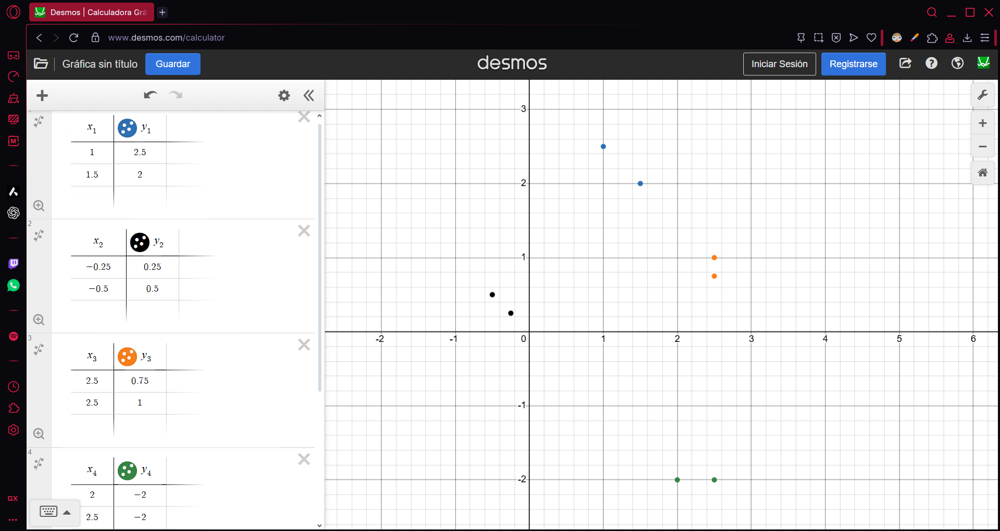
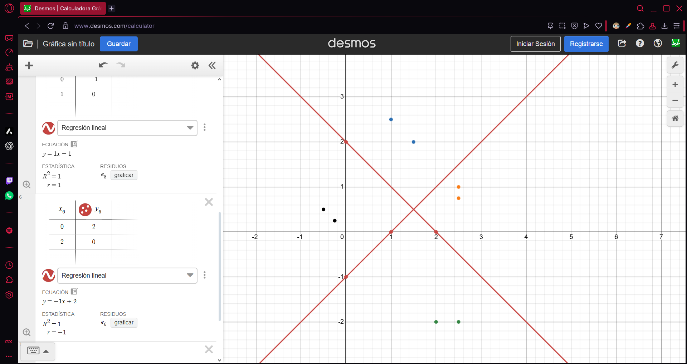

## Exercise 4

- $x_1 = [1, 2.5]$ (blue)
- $x_2 = [-0.25, 0.25]$ (black)
- $x_3 = [2.5, 0.75]$ (orange)
- $x_4 = [2, -2]$ (green)
- $x_5 = [1.5, 2]$ (blue)
- $x_6 = [-0.5, 0.5]$ (black)
- $x_7 = [2.5, 1]$ (orange)
- $x_8 = [2.5, -2]$ (green)

| class | u1  | u2  |
| ----- | --- | --- |
| 1     | -   | -   |
| 2     | -   | +   |
| 3     | +   | -   |
| 4     | +   | +   |

### Line 1

$m=(y_2 - y_1) \div (x_2 - x_1)$

$m=(0 - (-1)) \div (1 - 0) \rightarrow m = 1/1$

$m = 1$

$y = m * x + b  \rightarrow y = 1(x) + b \rightarrow 0 = 1(1) + b \rightarrow 0 = 1 + b \rightarrow b = -1$

$y = (1)x - 1$

$0 = x - y - 1 \rightarrow [1, -1]$

### Line 2

$m=(y_2 - y_1) \div (x_2 - x_1)$

$m=(0 - (2)) \div (2 - 0) \rightarrow m = -2/2$

$m = -1$

$y = m * x + b  \rightarrow y = -1(x) + b \rightarrow 0 = -1(2) + b \rightarrow 2 = b \rightarrow b = 2$

$y = (-1)x + 2$

$0 = -x - y +2 \rightarrow [-1, -1]$

### Matrix Multiplication (Get Activation Function)

$$
\begin{bmatrix}
1 & -1 \\
-1 & -1
\end{bmatrix}
\times
\begin{bmatrix}
3 \\
-3
\end{bmatrix}
+
\begin{bmatrix}
-1 \\
2
\end{bmatrix}
=
\begin{bmatrix}
6 \\
0
\end{bmatrix}
+
\begin{bmatrix}
-1 \\
2
\end{bmatrix}
=
\begin{bmatrix}
5 \\
2
\end{bmatrix}
$$
