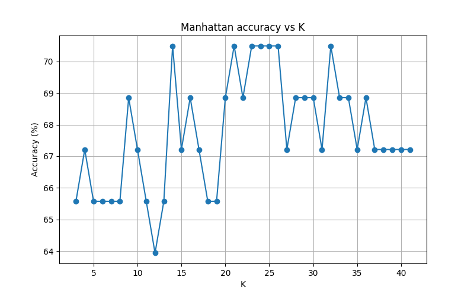

# Activity 1 KNN with Scikit learn & manual

**Ricardo Calvo - A01028889**

## Table of Contents

1. [Introduction](#introduction)
1. [Manual KNN](#manual-knn)
   1. [Best Euclidean results](#best-results-using-euclidean-distance-metric)
   1. [Best Manhattan results](#best-results-using-manhattan-distance-metric)
   1. [Best Minkowski results](#best-results-using-minkowski-distance-metric)
2. [KNN with Scikit learn](#knn-with-scikit-learn)
   1. [Best Euclidean results](#best-results-using-euclidean-distance-metric-scikit-learn)
   1. [Best Manhattan results](#best-results-using-manhattan-distance-metric-scikit-learn)
   1. [Best Minkowski results](#best-results-using-minkowski-distance-metric-scikit-learn)
1. [Conclusion](#conclusion)
## Introduction

In this report, we explore the implementation and performance of the K-Nearest Neighbors(KNN) algorithm using both a manual approach and the Scikit-learn library. The KNN algorithm is a simple machine learning technique used for classification tasks. It operates on the principle that similar data points are likely to belong to the same class.

The dataset used in this analysis contains various features related to heart health, with the goal of predicting the presence or absence of heart disease. First we are going to test the accuracy of the models using all features, getting the bestmodel based on the accuracy, our program will return the best distance metric (euclidean, manhattan or minkowski) and the best k value (from 3 to 41). Then, we will evaluate the contribution of each feature by systematically removing one feature at a time and observing the impact on model performance. 

[Return to Table of Contents](#table-of-contents)

 --- 

## Heatmap

We can see with the following graph the behavior between the data within our dataframe

Based on our heatmap, darker blue values represent strong negative correlations (close to -1), meaning that when one feature increases, the other tends to decrease. On the other hand, darker red values represent strong positive correlations (close to +1), where both features increase or decrease together. Values close to white (around 0) indicate little or no linear correlation.

[Return to Table of Contents](#table-of-contents)

 --- 

## Manual KNN

## Best results using Euclidean distance metric 

### k=7

| Predicted | Real Value | Correct? |
|-----------|------------|----------|
| 0 | 0 | True |
| 0 | 0 | True |
| 0 | 1 | False |
| 0 | 0 | True |
| 0 | 1 | False |
| 0 | 0 | True |
| 1 | 1 | True |
| 0 | 0 | True |
| 1 | 0 | False |
| 1 | 0 | False |
| 0 | 1 | False |
| 1 | 0 | False |
| 1 | 0 | False |
| 1 | 0 | False |
| 1 | 1 | True |
| 1 | 1 | True |
| 1 | 1 | True |
| 1 | 1 | True |
| 0 | 0 | True |
| 0 | 0 | True |
| 0 | 0 | True |
| 1 | 1 | True |
| 1 | 0 | False |
| 0 | 0 | True |
| 1 | 1 | True |
| 0 | 0 | True |
| 1 | 1 | True |
| 0 | 0 | True |
| 0 | 1 | False |
| 0 | 0 | True |
| 0 | 0 | True |
| 1 | 1 | True |
| 0 | 0 | True |
| 0 | 0 | True |
| 0 | 0 | True |
| 0 | 0 | True |
| 0 | 0 | True |
| 1 | 1 | True |
| 0 | 0 | True |
| 0 | 0 | True |
| 1 | 1 | True |
| 1 | 0 | False |
| 0 | 1 | False |
| 1 | 0 | False |
| 1 | 1 | True |
| 0 | 0 | True |
| 0 | 1 | False |
| 0 | 0 | True |
| 1 | 1 | True |
| 0 | 0 | True |
| 0 | 0 | True |
| 0 | 0 | True |
| 1 | 0 | False |
| 0 | 0 | True |
| 0 | 0 | True |
| 1 | 0 | False |
| 0 | 1 | False |
| 0 | 0 | True |
| 1 | 0 | False |
| 1 | 0 | False |
| 0 | 0 | True |

**Model accuracy: 68.8525%** 

 [Return to Table of Contents](#table-of-contents)

 --- 

## Best results using Manhattan distance metric 

### k=4

| Predicted | Real Value | Correct? |
|-----------|------------|----------|
| 0 | 0 | True |
| 0 | 0 | True |
| 0 | 1 | False |
| 0 | 0 | True |
| 1 | 1 | True |
| 0 | 0 | True |
| 1 | 1 | True |
| 0 | 0 | True |
| 1 | 0 | False |
| 1 | 0 | False |
| 1 | 1 | True |
| 1 | 0 | False |
| 1 | 0 | False |
| 1 | 0 | False |
| 0 | 1 | False |
| 0 | 1 | False |
| 0 | 1 | False |
| 1 | 1 | True |
| 0 | 0 | True |
| 0 | 0 | True |
| 0 | 0 | True |
| 1 | 1 | True |
| 1 | 0 | False |
| 0 | 0 | True |
| 1 | 1 | True |
| 0 | 0 | True |
| 1 | 1 | True |
| 0 | 0 | True |
| 0 | 1 | False |
| 0 | 0 | True |
| 0 | 0 | True |
| 0 | 1 | False |
| 0 | 0 | True |
| 0 | 0 | True |
| 0 | 0 | True |
| 0 | 0 | True |
| 0 | 0 | True |
| 1 | 1 | True |
| 0 | 0 | True |
| 0 | 0 | True |
| 0 | 1 | False |
| 1 | 0 | False |
| 1 | 1 | True |
| 1 | 0 | False |
| 1 | 1 | True |
| 0 | 0 | True |
| 1 | 1 | True |
| 0 | 0 | True |
| 1 | 1 | True |
| 0 | 0 | True |
| 0 | 0 | True |
| 0 | 0 | True |
| 1 | 0 | False |
| 0 | 0 | True |
| 0 | 0 | True |
| 1 | 0 | False |
| 0 | 1 | False |
| 0 | 0 | True |
| 0 | 0 | True |
| 0 | 0 | True |
| 0 | 0 | True |

**Model accuracy: 70.4918%** 

 [Return to Table of Contents](#table-of-contents)

 --- 

## Best results using Minkowski distance metric 

### k=34

| Predicted | Real Value | Correct? |
|-----------|------------|----------|
| 0 | 0 | True |
| 1 | 0 | False |
| 0 | 1 | False |
| 0 | 0 | True |
| 1 | 1 | True |
| 0 | 0 | True |
| 1 | 1 | True |
| 0 | 0 | True |
| 1 | 0 | False |
| 1 | 0 | False |
| 0 | 1 | False |
| 1 | 0 | False |
| 1 | 0 | False |
| 1 | 0 | False |
| 0 | 1 | False |
| 1 | 1 | True |
| 1 | 1 | True |
| 1 | 1 | True |
| 0 | 0 | True |
| 0 | 0 | True |
| 0 | 0 | True |
| 1 | 1 | True |
| 1 | 0 | False |
| 0 | 0 | True |
| 1 | 1 | True |
| 0 | 0 | True |
| 1 | 1 | True |
| 1 | 0 | False |
| 0 | 1 | False |
| 0 | 0 | True |
| 0 | 0 | True |
| 0 | 1 | False |
| 0 | 0 | True |
| 0 | 0 | True |
| 0 | 0 | True |
| 0 | 0 | True |
| 0 | 0 | True |
| 1 | 1 | True |
| 0 | 0 | True |
| 0 | 0 | True |
| 1 | 1 | True |
| 0 | 0 | True |
| 1 | 1 | True |
| 1 | 0 | False |
| 1 | 1 | True |
| 0 | 0 | True |
| 0 | 1 | False |
| 0 | 0 | True |
| 1 | 1 | True |
| 0 | 0 | True |
| 0 | 0 | True |
| 0 | 0 | True |
| 1 | 0 | False |
| 0 | 0 | True |
| 0 | 0 | True |
| 1 | 0 | False |
| 0 | 1 | False |
| 0 | 0 | True |
| 1 | 0 | False |
| 1 | 0 | False |
| 0 | 0 | True |

**Model accuracy: 67.2131%** 

 [Return to Table of Contents](#table-of-contents)

 --- 

## KNN with Scikit learn

## Best results using Euclidean distance metric scikit learn

### k=4

| Predicted | Real Value | Correct? |
|-----------|------------|----------|
| 0 | 0 | True |
| 1 | 0 | False |
| 0 | 1 | False |
| 0 | 0 | True |
| 0 | 1 | False |
| 0 | 0 | True |
| 1 | 1 | True |
| 0 | 0 | True |
| 1 | 0 | False |
| 1 | 0 | False |
| 0 | 1 | False |
| 1 | 0 | False |
| 1 | 0 | False |
| 1 | 0 | False |
| 0 | 1 | False |
| 0 | 1 | False |
| 1 | 1 | True |
| 1 | 1 | True |
| 0 | 0 | True |
| 0 | 0 | True |
| 0 | 0 | True |
| 1 | 1 | True |
| 1 | 0 | False |
| 0 | 0 | True |
| 1 | 1 | True |
| 0 | 0 | True |
| 1 | 1 | True |
| 0 | 0 | True |
| 0 | 1 | False |
| 0 | 0 | True |
| 0 | 0 | True |
| 1 | 1 | True |
| 0 | 0 | True |
| 0 | 0 | True |
| 0 | 0 | True |
| 0 | 0 | True |
| 0 | 0 | True |
| 1 | 1 | True |
| 0 | 0 | True |
| 0 | 0 | True |
| 1 | 1 | True |
| 0 | 0 | True |
| 0 | 1 | False |
| 1 | 0 | False |
| 1 | 1 | True |
| 0 | 0 | True |
| 0 | 1 | False |
| 0 | 0 | True |
| 1 | 1 | True |
| 0 | 0 | True |
| 0 | 0 | True |
| 0 | 0 | True |
| 1 | 0 | False |
| 0 | 0 | True |
| 0 | 0 | True |
| 1 | 0 | False |
| 0 | 1 | False |
| 0 | 0 | True |
| 0 | 0 | True |
| 0 | 0 | True |
| 0 | 0 | True |

**Model accuracy: 68.8525%** 

 [Return to Table of Contents](#table-of-contents)

 --- 

## Best results using Manhattan distance metric scikit learn

### k=14

| Predicted | Real Value | Correct? |
|-----------|------------|----------|
| 0 | 0 | True |
| 1 | 0 | False |
| 0 | 1 | False |
| 0 | 0 | True |
| 1 | 1 | True |
| 0 | 0 | True |
| 1 | 1 | True |
| 0 | 0 | True |
| 1 | 0 | False |
| 0 | 0 | True |
| 0 | 1 | False |
| 1 | 0 | False |
| 1 | 0 | False |
| 1 | 0 | False |
| 0 | 1 | False |
| 1 | 1 | True |
| 0 | 1 | False |
| 1 | 1 | True |
| 0 | 0 | True |
| 0 | 0 | True |
| 0 | 0 | True |
| 1 | 1 | True |
| 1 | 0 | False |
| 0 | 0 | True |
| 1 | 1 | True |
| 0 | 0 | True |
| 1 | 1 | True |
| 0 | 0 | True |
| 1 | 1 | True |
| 0 | 0 | True |
| 0 | 0 | True |
| 0 | 1 | False |
| 0 | 0 | True |
| 0 | 0 | True |
| 0 | 0 | True |
| 0 | 0 | True |
| 0 | 0 | True |
| 1 | 1 | True |
| 0 | 0 | True |
| 0 | 0 | True |
| 1 | 1 | True |
| 0 | 0 | True |
| 1 | 1 | True |
| 1 | 0 | False |
| 1 | 1 | True |
| 0 | 0 | True |
| 0 | 1 | False |
| 0 | 0 | True |
| 1 | 1 | True |
| 0 | 0 | True |
| 0 | 0 | True |
| 0 | 0 | True |
| 1 | 0 | False |
| 0 | 0 | True |
| 0 | 0 | True |
| 1 | 0 | False |
| 0 | 1 | False |
| 0 | 0 | True |
| 1 | 0 | False |
| 1 | 0 | False |
| 0 | 0 | True |

**Model accuracy: 70.4918%** 

 [Return to Table of Contents](#table-of-contents)

 --- 

## Best results using Minkowski distance metric scikit learn

### k=4

| Predicted | Real Value | Correct? |
|-----------|------------|----------|
| 0 | 0 | True |
| 1 | 0 | False |
| 0 | 1 | False |
| 0 | 0 | True |
| 0 | 1 | False |
| 0 | 0 | True |
| 1 | 1 | True |
| 0 | 0 | True |
| 1 | 0 | False |
| 1 | 0 | False |
| 0 | 1 | False |
| 1 | 0 | False |
| 1 | 0 | False |
| 1 | 0 | False |
| 0 | 1 | False |
| 0 | 1 | False |
| 1 | 1 | True |
| 1 | 1 | True |
| 0 | 0 | True |
| 0 | 0 | True |
| 0 | 0 | True |
| 1 | 1 | True |
| 1 | 0 | False |
| 0 | 0 | True |
| 1 | 1 | True |
| 0 | 0 | True |
| 1 | 1 | True |
| 0 | 0 | True |
| 0 | 1 | False |
| 0 | 0 | True |
| 0 | 0 | True |
| 1 | 1 | True |
| 0 | 0 | True |
| 0 | 0 | True |
| 0 | 0 | True |
| 0 | 0 | True |
| 0 | 0 | True |
| 1 | 1 | True |
| 0 | 0 | True |
| 0 | 0 | True |
| 1 | 1 | True |
| 0 | 0 | True |
| 0 | 1 | False |
| 1 | 0 | False |
| 1 | 1 | True |
| 0 | 0 | True |
| 0 | 1 | False |
| 0 | 0 | True |
| 1 | 1 | True |
| 0 | 0 | True |
| 0 | 0 | True |
| 0 | 0 | True |
| 1 | 0 | False |
| 0 | 0 | True |
| 0 | 0 | True |
| 1 | 0 | False |
| 0 | 1 | False |
| 0 | 0 | True |
| 0 | 0 | True |
| 0 | 0 | True |
| 0 | 0 | True |

**Model accuracy: 68.8525%** 

 [Return to Table of Contents](#table-of-contents)

 --- 

## Conclusion

After completing all test we got that the best way to evaluatethe probability of someone having heart issues is by using **sckit-learn** since is the one with the bigger accuracy on **70.4918%**, when **k = 14** calculating the distance with **Manhattan** metric distance.

As we can see in the Scikit-learn performance graph, there was no significant difference in accuracy when using the Euclidean, Manhattan, or Minkowski distance metrics. This suggests that for this specific dataset, the  feature distribution is such that the method of calculating distance between data has a minimal effect on the KNN model's predictive capability. 

However we were able to get our accuracy to **72.1311%** with our manual functions using **Manhattan** metric distance when **k = 3** using the folowwing data: Gender, Chest pain, Arterial pressure, Cholesterol, Glucose, EGG, Heart rate, Exercise angina, ST depression, ST Segment, Number of vessels, Thalassemia, on the other hand, by using Scikit-learn functions we could get our accuracy to **73.7705%** when using Manhattan metric distance, when **k = 28** when we use the following data: Gender, Chest pain, Arterial pressure, Cholesterol, Glucose, EGG, Heart rate, Exercise angina, ST depression, ST Segment, Number of vessels, Thalassemia, 

[Return to Table of Contents](#table-of-contents)

 --- 

