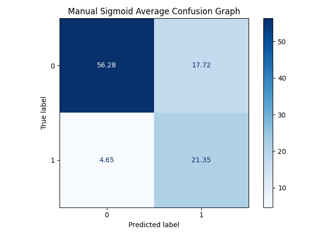
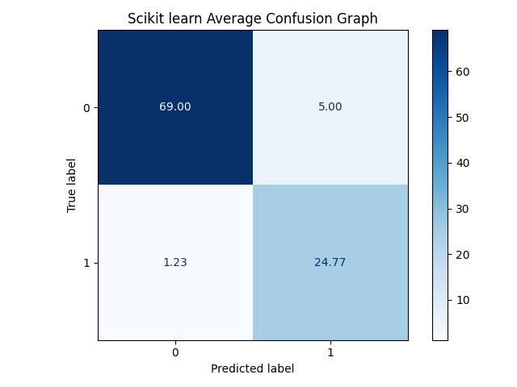

# Activity 2 logistic regression  with Scikit learn & manual

**Ricardo Calvo - A01028889**

## Table of Contents

1. [Introduction](#introduction)
1. [Manual LR](#manual-lr)
2. [Scikit learn LR](#scikit-learn-lr)
1. [Conclusion](#conclusion)
## Introduction

In this report, we study the implementation and performance of the Logistic Regression algorithm using a manual implementation and the Scikit-learn library. Logistic Regression is a fundamental machine learning method widely applied to binary classification problems. It models the probability that a given input belongs to a specific class through the use of an activation function.

The dataset selected for this analysis is the Breast Cancer Wisconsin dataset, which contains clinical features that help distinguish between benign and malignant cases. For the manual implementation, the dataset is preprocessed by converting the class labels into numerical values (0 for benign and 1 for malignant), ensuring the correct input format for the algorithm.

The results will help compare the both approaches, as well as highlight the effect of activation functions and hyperparameters on the final model performance.

For the manual approach, we use part of the code provided by the professor with two activation functions: the standard sigmoid and, as our proposal, the tanh function.

In this approach, we will set the number of iterations from 1 to 100, and for each iteration count we also set the learning rate parameter (alpha) in a range from 0.01 to 0.3.

We will do the same experiment using the scikit-learn implementation. Since scikit-learn does not allow direct control over the learning rate (alpha), we vary the regularization parameter C instead, while also testing iteration counts from 1 to 100.

[Return to Table of Contents](#table-of-contents)

 ---

## Manual LR

In the case of the **Manual implementation**, we evaluated different configurations by varying the number of iterations and the learning parameter (alpha for the manual approach or the regularization parameter C for the scikit-learn implementation). Two activation functions were tested: the standard sigmoid function and the tanh function.

### Best Results
The best overall **accuracy** was 90.00%, achieved using the **Tanh** activation function, with 1 iterations and an alpha/C value of 0.28.

For **precision**, the highest value obtained was 100.00%, with the Tanh activation function, 18 iterations, and alpha/C = 0.14. A precision this high with such a small number of iterations in our experiments suggests that the model was very effective at avoiding false positives under that configuration. Nevertheless, results of this kind often arise when the model predicts only a limited number of positive cases, so the outcome should be interpreted with caution in terms of generalization.

The best **recall** reached was 100.00%, using the Sigmoid activation function, with 4 iterations when alpha/C = 0.22. A recall this high in such an early stage of training indicates that the model was able to correctly capture nearly all of the actual positive cases. However, in practice this can also happen when the model tends to classify most inputs as positives, which increases sensitivity but may come at the cost of precision. This highlights the importance of considering multiple metrics together to assess the overall quality of the model.

### Average Results
When averaging the performance over the full range of iterations and alpha/C values, the model obtained an **average accuracy of 77.63%**, an **average precision of 60.56% **, and an **average recall of 82.10% **. These results suggest that while the model can reach strong performance under optimal settings, its overall stability across all configurations is slightly lower.

### Average Confusion Matrix
The following confusion matrix shows the average counts of true positives, false positives, true negatives, and false negatives across all runs. This provides a global view of the classification performance of the model:

### Average Results (Tanh)
Using the **tanh** activation function, the model reached an **average accuracy of 76.99% **, an **average precision of 59.85% **, and an **average recall of 82.52% **. Compared with the sigmoid results, these values highlight how the choice of activation function can slightly alter the trade-off between precision and recall, even when the same range of iterations and alpha/C values is used.

### Average Confusion Matrix (Tanh)
The confusion matrix below summarizes the averaged classification outcomes when using tanh. By contrasting it with the sigmoid-based matrix, one can observe whether tanh tends to favor recall (capturing more true positives) or precision (avoiding false positives) under similar conditions:

[Return to Table of Contents](#table-of-contents)

 ---

## Scikit learn LR

In the case of the **Scikit learn implementation**, we evaluated different configurations by varying the number of iterations and the learning parameter (alpha for the manual approach or the regularization parameter C for the scikit-learn implementation). Two activation functions were tested: the standard sigmoid function and the tanh function.

### Best Results
The best overall **accuracy** was 94.00%, achieved using the **** activation function, with 1 iterations and an alpha/C value of 0.01.

For **precision**, the highest value obtained was 83.33%, with the  activation function, 1 iterations, and alpha/C = 0.01. A precision this high with such a small number of iterations in our experiments suggests that the model was very effective at avoiding false positives under that configuration. Nevertheless, results of this kind often arise when the model predicts only a limited number of positive cases, so the outcome should be interpreted with caution in terms of generalization.

The best **recall** reached was 96.15%, using the  activation function, with 1 iterations when alpha/C = 0.01. A recall this high in such an early stage of training indicates that the model was able to correctly capture nearly all of the actual positive cases. However, in practice this can also happen when the model tends to classify most inputs as positives, which increases sensitivity but may come at the cost of precision. This highlights the importance of considering multiple metrics together to assess the overall quality of the model.

### Average Results
When averaging the performance over the full range of iterations and alpha/C values, the model obtained an **average accuracy of 93.77% **, an **average precision of 83.20% **, and an **average recall of 95.26% **. These results suggest that while the model can reach strong performance under optimal settings, its overall stability across all configurations is slightly lower.

### Average Confusion Matrix
The following confusion matrix shows the average counts of true positives, false positives, true negatives, and false negatives across all runs. This provides a global view of the classification performance of the model:

[Return to Table of Contents](#table-of-contents)

 ---
