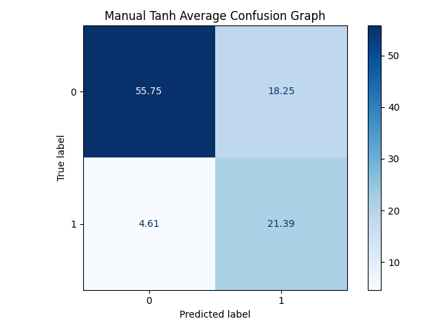
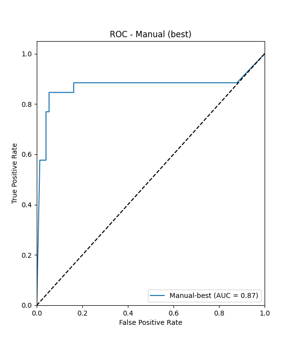
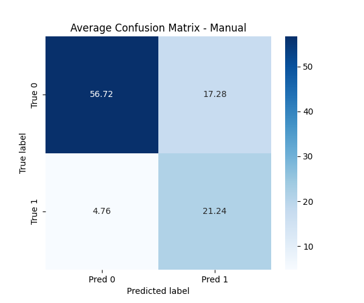
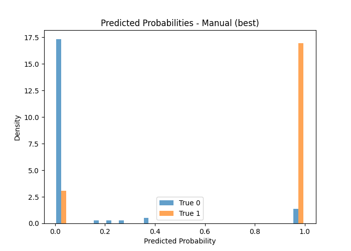
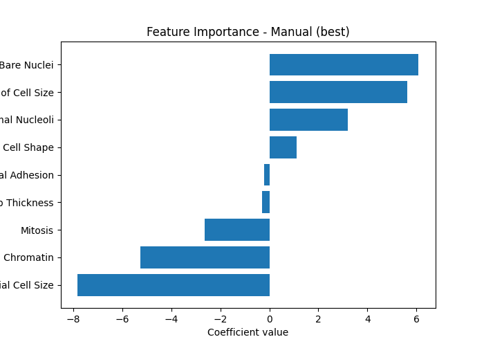
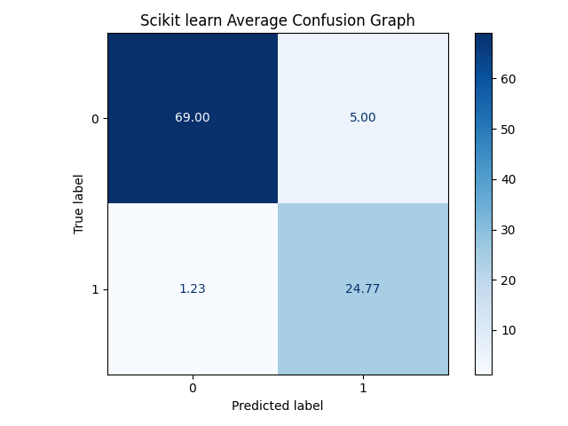
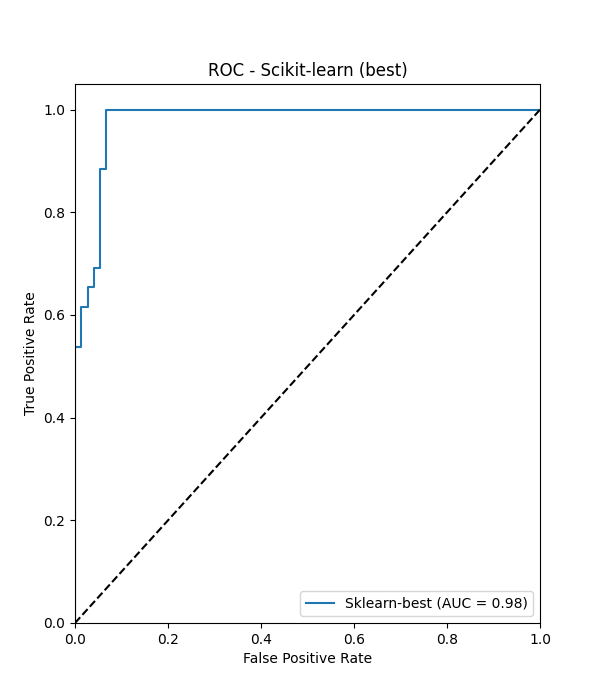
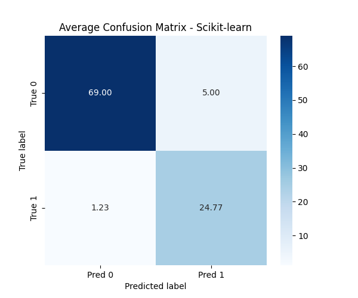
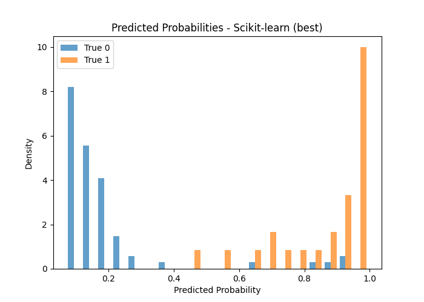
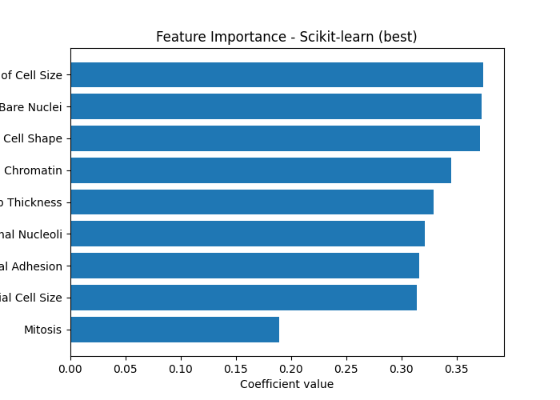

# Activity 2 logistic regression  with Scikit learn & manual

**Ricardo Calvo - A01028889**

## Table of Contents

1. [Introduction](#introduction)
1. [Manual LR](#manual-lr)
2. [Scikit learn LR](#scikit-learn-lr)
1. [Conclusion](#conclusion)
## Introduction

In this report, we study the implementation and performance of the Logistic Regression algorithm using a manual implementation and the Scikit-learn library. Logistic Regression is a fundamental machine learning method widely applied to binary classification problems. It models the probability that a given input belongs to a specific class through the use of an activation function.

The dataset selected for this analysis is the Breast Cancer Wisconsin dataset, which contains clinical features that help distinguish between benign and malignant cases. For the manual implementation, the dataset is preprocessed by converting the class labels into numerical values (0 for benign and 1 for malignant), ensuring the correct input format for the algorithm.

The results will help compare the both approaches, as well as highlight the effect of activation functions and hyperparameters on the final model performance.

For the manual approach, we use part of the code provided by the professor with two activation functions: the standard sigmoid and, as our proposal, the tanh function.

We selected the tanh function as an alternative because, unlike the sigmoid, it is zero-centered, producing outputs in the range of -1 to 1. This property can help the optimization process converge faster in some cases and reduce issues with gradients being biased toward positive values. By comparing both activation functions, we aimed to evaluate whether this theoretical advantage of tanh translates into better performance in practice.

In this approach, we will set the number of iterations from 1 to 100, and for each iteration count we also set the learning rate parameter (alpha) in a range from 0.01 to 0.3.

We will do the same experiment using the scikit-learn implementation. Since scikit-learn does not allow direct control over the learning rate (alpha), we vary the regularization parameter C instead, while also testing iteration counts from 1 to 100.

[Return to Table of Contents](#table-of-contents)

 --- 

## Manual LR

In the case of the **Manual implementation**, we evaluated different configurations by varying the number of iterations and the learning parameter (alpha for the manual approach or the regularization parameter C for the scikit-learn implementation). Two activation functions were tested: the standard sigmoid function and the tanh function.

### Best Results
The best overall **accuracy** was 91.00%, achieved using the **Tanh** activation function, with 26 iterations and an alpha/C value of 0.17.

For **precision**, the highest value obtained was 100.00%, with the Tanh activation function, 1 iterations, and alpha/C = 0.16. A precision this high with such a small number of iterations in our experiments suggests that the model was very effective at avoiding false positives under that configuration. Nevertheless, results of this kind often arise when the model predicts only a limited number of positive cases, so the outcome should be interpreted with caution in terms of generalization.

The best **recall** reached was 100.00%, using the Tanh activation function, with 1 iterations when alpha/C = 0.13. A recall this high in such an early stage of training indicates that the model was able to correctly capture nearly all of the actual positive cases. However, in practice this can also happen when the model tends to classify most inputs as positives, which increases sensitivity but may come at the cost of precision. This highlights the importance of considering multiple metrics together to assess the overall quality of the model.

### Average Results
When averaging the performance over the full range of iterations and alpha/C values, the model obtained an **average accuracy of 77.84%**, an **average precision of 60.82%**, and an **average recall of 82.00%**. These results suggest that while the model can reach strong performance under optimal settings, its overall stability across all configurations is slightly lower.

### Average Confusion Matrix
The following confusion matrix shows the average counts of true positives, false positives, true negatives, and false negatives across all runs. This provides a global view of the classification performance of the model:

### Average Results (Tanh)
Using the **tanh** activation function, the model reached an **average accuracy of 77.38%**, an **average precision of 60.40%**, and an **average recall of 82.24%**. Compared with the sigmoid results, these values highlight how the choice of activation function can slightly alter the trade-off between precision and recall, even when the same range of iterations and alpha/C values is used.

### Average Confusion Matrix (Tanh)
The confusion matrix below summarizes the averaged classification outcomes when using tanh. By contrasting it with the sigmoid-based matrix, one can observe whether tanh tends to favor recall (capturing more true positives) or precision (avoiding false positives) under similar conditions:

[Return to Table of Contents](#table-of-contents)

 --- 

### Manual Graphs

For the **manual implementation**, we can see thorugh our graphs how the model behaves under its best configuration based on the highest accuracy. The ROC curve illustrates its ability to distinguish between classes across different thresholds, while the average confusion matrix shows the typical distribution of correct and incorrect predictions across multiple runs. The probability distribution plot helps us assess how confident the manual model is when making decisions, and the feature importance chart highlights which input variables had the greatest impact on its predictions.

The ROC curve of the manual implementation exhibits a sharp increase in the true positive rate once the false positive rate exceeds 0.5, indicating that the model begins to capture a significant portion of the positives relatively quickly. After this point, the curve maintains a noticeable upward trend, continuing to gain sensitivity until it surpasses the 0.8 mark. Beyond this threshold, the growth becomes more gradual and the curve tends to flatten, moving closer to the diagonal slope. This pattern suggests that while the manual model is effective at identifying positive cases early on, its improvements slow down at higher thresholds, reflecting diminishing returns in discriminative capacity as it approaches its maximum performance.

The average confusion matrix of the manual implementation shows that the model is strong at recognizing negative cases, producing many true negatives and relatively few false positives. On the positive side, it is able to capture a significant portion of actual positive cases, although some false negatives remain. In the context of breast cancer detection, false negatives are particularly critical because they represent missed diagnoses. While the manual model demonstrates a balanced behavior, its performance suggests a slight tendency to prioritize avoiding false alarms over fully capturing all positive cases, which is an important consideration for medical applications.

The probability distribution for the manual implementation shows that the model tends to assign probabilities close to 0 for negative cases and close to 1 for positive cases. This separation indicates that the classifier is confident in most of its predictions, with only a small number of instances falling into intermediate ranges. From a clinical perspective, such behavior is useful because it minimizes uncertainty when classifying a case: most predictions are made with high confidence. However, the few positive cases that appear near low probability values are concerning, as they represent situations where the model could miss a true cancer diagnosis. This underlines the importance of recall in medical applications, where it is preferable to reduce false negatives even if it comes at the cost of slightly more false positives.

The feature importance plot for the manual implementation highlights which attributes of the dataset had the greatest impact on the model’s predictions. Variables such as *Bare Nuclei*, *Uniformity of Cell Size*, and *Normal Nucleoli* appear with strong positive coefficients, meaning that higher values in these features are strongly associated with predicting malignant cases. On the other hand, attributes like *Marginal Cell Size* and *Chromatin* show negative coefficients, suggesting that higher values of these variables push the prediction toward the benign class. Features closer to zero, such as *Clump Thickness* or *Cell Adhesion*, contributed little to the decision-making process in this configuration. In the context of breast cancer detection, this analysis helps to identify which cell characteristics the model found most informative for distinguishing between benign and malignant samples.

## Scikit learn LR

In the case of the **Scikit learn implementation**, we evaluated different configurations by varying the number of iterations and the learning parameter (alpha for the manual approach or the regularization parameter C for the scikit-learn implementation). Two activation functions were tested: the standard sigmoid function and the tanh function.

### Best Results
The best overall **accuracy** was 94.00%, achieved using the **** activation function, with 1 iterations and an alpha/C value of 0.01.

For **precision**, the highest value obtained was 83.33%, with the  activation function, 1 iterations, and alpha/C = 0.01. A precision this high with such a small number of iterations in our experiments suggests that the model was very effective at avoiding false positives under that configuration. Nevertheless, results of this kind often arise when the model predicts only a limited number of positive cases, so the outcome should be interpreted with caution in terms of generalization.

The best **recall** reached was 96.15%, using the  activation function, with 1 iterations when alpha/C = 0.01. A recall this high in such an early stage of training indicates that the model was able to correctly capture nearly all of the actual positive cases. However, in practice this can also happen when the model tends to classify most inputs as positives, which increases sensitivity but may come at the cost of precision. This highlights the importance of considering multiple metrics together to assess the overall quality of the model.

### Average Results
When averaging the performance over the full range of iterations and alpha/C values, the model obtained an **average accuracy of 93.77%**, an **average precision of 83.20%**, and an **average recall of 95.26%**. These results suggest that while the model can reach strong performance under optimal settings, its overall stability across all configurations is slightly lower.

### Average Confusion Matrix
The following confusion matrix shows the average counts of true positives, false positives, true negatives, and false negatives across all runs. This provides a global view of the classification performance of the model:

[Return to Table of Contents](#table-of-contents)

 --- 

### Scikit Learn Graphs

For the **scikit-learn implementation**, we present the same set of graphs for consistency and comparison. The ROC curve reflects the classification trade-offs achieved by the optimized solver, and the average confusion matrix summarizes its stability over different runs. The probability distribution plot reveals how well-calibrated the scikit-learn model is in assigning probabilities, while the feature importance chart provides insights into how the learned coefficients influence the final predictions. Together, these figures allow us to contrast the manual and library-based approaches under a common framework.

The ROC curve for the scikit-learn implementation shows a very strong discriminative performance. Unlike the manual approach, the curve begins at a higher true positive rate even when the false positive rate is close to zero, indicating that the model can correctly identify many positive cases from the start. The curve continues to rise quickly, reaching values close to the maximum true positive rate, and then stabilizes near the upper bound. This behavior suggests that the scikit-learn model achieves high sensitivity without incurring many false positives, and the area under the curve being close to 1 confirms that its overall classification power is superior compared to the manual implementation. In medical applications like breast cancer detection, this is a valuable property because it means the model can capture most positive cases with minimal risk of missing diagnoses.

The average confusion matrix of the scikit-learn implementation reveals a very balanced performance, with a large majority of true negatives and true positives compared to the misclassified cases. The number of false positives is low, which means the model rarely classifies healthy patients as having cancer, and the number of false negatives is minimal, which is particularly important in a medical context. This pattern indicates that the scikit-learn model not only achieves strong precision by limiting false alarms, but also maintains a high recall by successfully detecting most positive cases. Overall, this configuration shows a model that is highly reliable for breast cancer detection, minimizing the risk of missed diagnoses while avoiding unnecessary false alerts.

The probability distribution of the scikit-learn model shows a clearer separation between the two classes compared to the manual approach. Most negative cases concentrate near probability values close to zero, while the majority of positive cases are shifted toward values close to one. Although there is still some overlap in the intermediate range, the separation is more distinct, which indicates that the scikit-learn model assigns probabilities in a way that reflects stronger confidence in its predictions. From a medical standpoint, this behavior reduces uncertainty in decision-making, as the model provides more polarized outputs that make it easier to differentiate between benign and malignant cases. The reduced presence of positive cases in the low-probability region suggests a lower risk of false negatives compared to the manual implementation.

The feature importance plot of the scikit-learn implementation shows that all coefficients are positive, which contrasts with the manual implementation where some variables contributed negatively. In this case, features such as *Uniformity of Cell Size*, *Bare Nuclei*, and *Cell Shape* stand out as the most influential, all pushing the prediction toward the malignant class when their values increase. Other attributes, including *Clump Thickness* and *Chromatin*, also show notable contributions, while *Mitosis* appears less relevant in comparison. The absence of negative coefficients suggests that, under the solver and scaling used by scikit-learn, the model interprets all features as risk indicators, though with varying magnitudes. This contrasts with the manual model, which allowed some variables to act as protective factors, reducing the likelihood of a malignant classification. From an interpretability standpoint, the scikit-learn results highlight a more uniform direction of influence, making it easier to identify which features consistently push the classification toward malignancy.

## Conclusion

Throughout this work we implemented logistic regression in two ways: a manual version using sigmoid and tanh activation functions, and a scikit-learn implementation using the standard library solver. Both approaches allowed us to explore the impact of iteration counts, learning parameters, and activation choices on the performance of the model when applied to breast cancer classification.

The manual implementation proved useful as an educational tool, showing how changes in the learning rate or the number of iterations affect the stability of accuracy, precision, and recall. The inclusion of tanh provided an additional perspective, demonstrating how a zero-centered activation function can influence the optimization process. However, the manual results also revealed some limitations, including more variability in performance and the presence of configurations that could easily overfit or underperform depending on parameter choices.

On the other hand, the scikit-learn implementation consistently achieved stronger and more stable results. Its ROC curve showed higher sensitivity with fewer false positives, and the average confusion matrix confirmed a very low rate of false negatives — a crucial aspect in the context of breast cancer detection. The probability distributions were better separated between classes, and the feature importance plot highlighted consistent predictors without contradictory contributions. Altogether, these results suggest that while the manual approach helps us understand the inner mechanics of logistic regression, the scikit-learn implementation provides more reliable and clinically applicable outcomes.

In conclusion, scikit-learn not only simplifies the training process but also enhances performance stability, making it the preferred option when the objective is to deploy logistic regression in real-world medical problems where minimizing false negatives is essential. The manual model, however, remains a valuable didactic resource for understanding the algorithm’s behavior and the influence of its hyperparameters.

