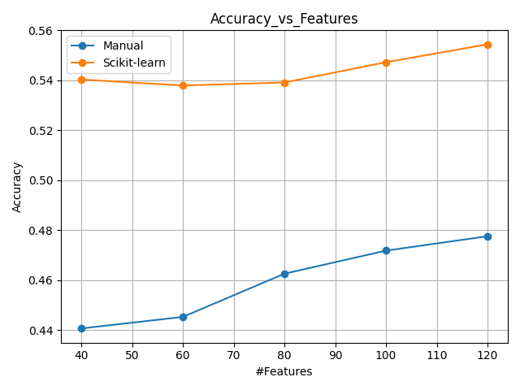
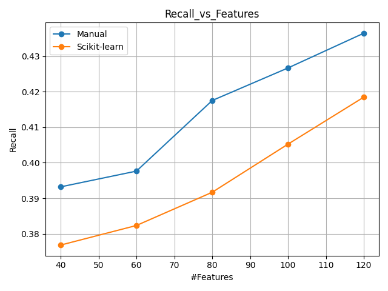
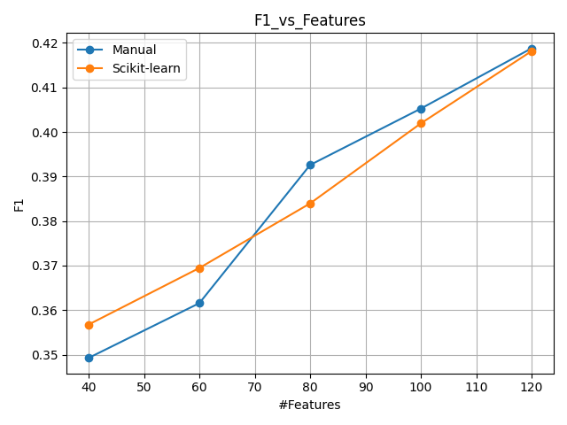
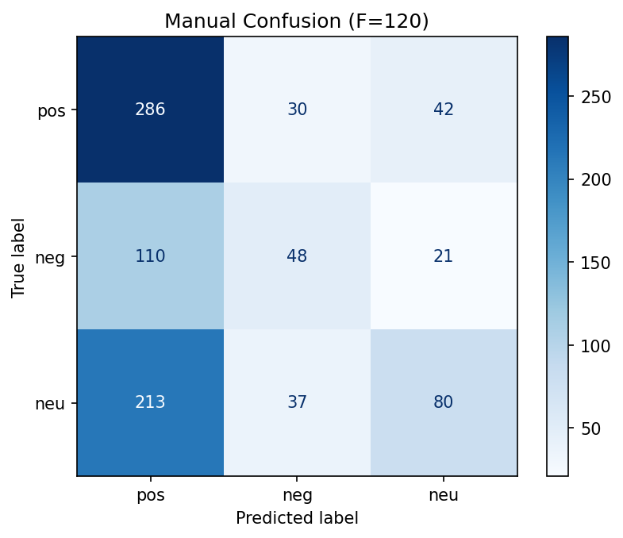
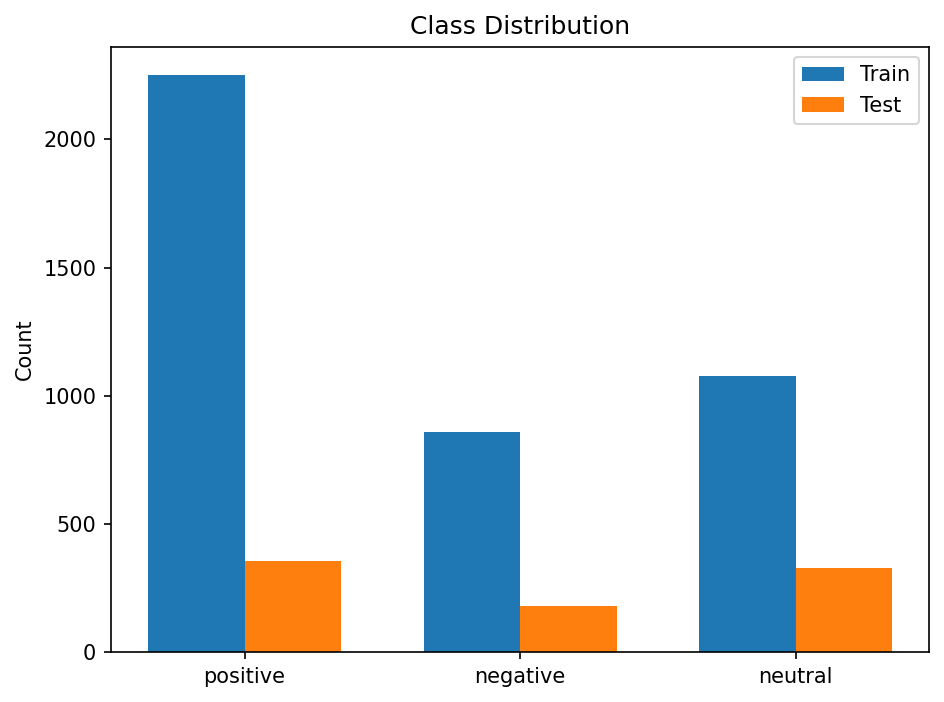
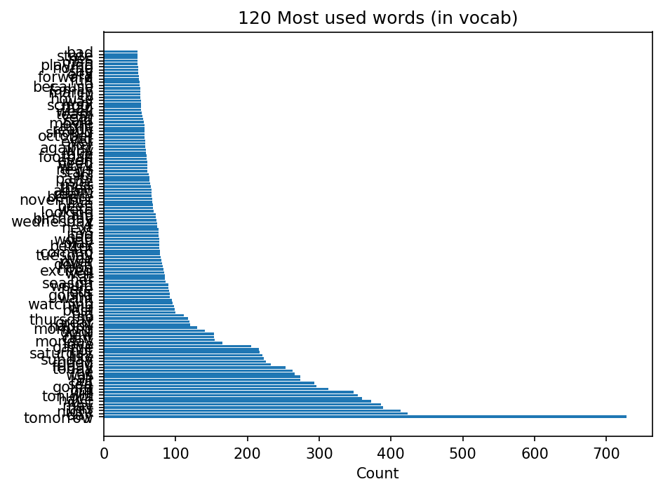

# Activity 3 Naive Bayes  with Scikit learn & manual

**Ricardo Calvo - A01028889**

## Table of Contents

1. [Introduction](#introduction)
1. [Manual NB](#manual-nb)
1. [Scikit learn NB](#scikit-learn-nb)
1. [Graphs](#graphs)
1. [Conclusion](#conclusion)
## Introduction

This report studies a Naive Bayes text classifier implemented in two ways: a manual Multinomial NB and a scikit-learn baseline. The task is 3-class sentiment classification with labels this ones being: positive, negative and neutral.

The dataset used is plain-text lines in the form `words @@@ label` split into training and test files. We convert text into a Bag-of-Words representation using tokenization, lowercasing, stopword filtering, and word frequency counts (not binary presence).

To decide what words we didn't want in our model, we chose the F most popular words, and based on what words was, we discard it or not, for example, some of the words we dont want in our model are `and`, `or`, `is`, etc.For our manual model we did a multinomial Naive Bayes. We estimate class priors and per-class word likelihoods from the training data and score documents by the sum of log-likelihoods plus log-priors.

For the scikit-learn implementation we used a pipeline CountVectorizer → MultinomialNB. The vectorizer learns the vocabulary on each fold, enforces a maximum vocabulary size, and applies the same text preprocessing. The NB uses the default additive smoothing.

Evaluation: we sweep the vocabulary size F ∈ {20, 40, 60, 80, 100, 120} and perform Stratified K-fold cross-validation with K ∈ {3, 4, 5, 6} on the training split. We report macro accuracy, macro recall, and macro F1. We also show matrices that shows us a better view of how this network works. 

Finally, we compare the manual model against scikit-learn and discuss the impact of vocabulary size, stopwords, and class imbalance.

[Return to Table of Contents](#table-of-contents)

---

## Manual LR

Here are the best results we got with Manual: **accuracy 47.75%** with **120 features**, a **recall 43.65%** with **120 features**, and a **F1 41.88%** with **120 features**.

These results are on the low side, more likely because of a small or noisy vocabulary, generic words left in (or useful terms filtered out), simple tokenization, class imbalance that favors the majority class, weak handling of negations, or a train/test shift. We can improve by refining the stopword list , increasing the number of features as we can see that our best values, are with a greater number of features, and using stratified splits for evaluation.

## Scikit Learn LR

For the best results using Scikit Learn we got an **accuracy 55.43%** with **120 features** when **K=6**a **recall 41.85%** with **120 features** when **K=6**, and an **F1 41.81%** with **120 features** when **K=6**.

These results reflect the pipeline setup that learns its own vocabulary during cross-validation and keeps preprocessing consistent. This scores feel low but they are greater than our manual implementation, trying a larger vocabulary, refine the stopword list, add lemmatization, may improve the check class balance.

[Return to Table of Contents](#table-of-contents)

---

## Graphs

The following graphs show how accuracy, recall, and F1 behaves with the number of features, comparing the manual implementation with the scikit-learn implementation.

### Accuracy vs. Number of Features

The scikit-learn implementation shows higher accuracy across all vocabulary sizes. In both approaches, adding more features generally makes our accuracy higher. Scikit-learn decreases slightly with very small vocabularies and then climbs, and  the manual version rises more between mid and large vocabularies. The persistent gap suggests that fold-wise vocabulary learning and preprocessing help the scikit-learn pipeline capture more signal. Meaning better text preprocessing and feature extraction matter more than the classifier path. To improve the manual model, refine the stopword list while keeping negations, and increase the number of features until the curve stabilize.

### Recall vs. Number of Features

As we can see, the Recall increases as we add more features in both implementations simillar to the previous graph. The manual model stays ahead at all sizes, with a noticeable jump from mid to larger vocabularies. Scikit-learn also improves but more slowly, simillar to a linear growth. What this means is that a larger vocabulary helps the models recover more true examples from each class. To increasethe recall, filter  the vocabulary (keeping informative terms and negations) and address class imbalance.

### F1 vs. Number of Features

Same to the other ones F1 increases steadily as the vocabulary grows in both implementations. With fewer features, scikit-learn leads, then the manual model catches up at the largest size. Meaning that with  more features we can improve the balance between precision and recall, with diminishing returns near the end.

 

## Manual Confusion matrix (F=120)

This matrix shows a strong bias toward the **positive** class. Most errors are neutral→positive and negative→positive, so positive has high recall but only moderate precision. In contrast, **negative** and **neutral** have low recall (many of their true examples are missed) and are frequently predicted as positive.

This model over predicts positive, likely due to class imbalance and limited vocabulary signal. Whether false positives or false negatives are more problematic depends on the use case, but this pattern means the system will often label non-positive texts as positive and will miss many negative/neutral classes.

## Scikit-learn  Confusion matrix (F=120)

Similar to the Manual Confusion matrix, this model biased toward the **positive** class. Most mistakes are neutral→positive and negative→positive, so positive recall is high while precision is only moderate. **Negative** and especially **neutral** have low recall (many of their true cases are missed and flipped to positive).

This model will mark many non-positive texts as positive, which is risky if false positives are costly. 

## Class distribution

The plot shows clear imbalance since the positive class is larger then neutral and  negative. This pushes the learned priors toward positive, so with weak evidence the model tends to predict positive. This may affect theaccuracy making it look optimistic, recall for negative and neutral drops, and many of their true cases are mislabeled as positive.

To mitigate this problems we can always show per-class precision, recall, and F1, and  try uniform or tuned class priors rebalance the training set and improve text preprocessing.

### Most frequent words

Most of the top words carry little or no sentiment. They show up in all three classes, so they don’t separate them well. This isn’t necessarily bias, but it could represent weakness: in the model, leaning more on priors and whatever context slips through.[Return to Table of Contents](#table-of-contents)

---

## Conclusion

After doing the experiments we learned that vocabulary quality and preprocessing drive performance more than the specific Naive Bayes variant. As we increased the number of features, both models improved, but gains tapered off at larger vocabularies. We also saw a strong class imbalance toward the positive label, which pushed both models to over-predict that class and miss many negative and neutral cases. It is very important to filter what words you consider wont contribute as well as other words, normally this words are connection words as we talked in the introduction

Between the two approaches, the scikit-learn pipeline performed better overall. It consistently reached higher accuracy and competitive F1 because it learns the vocabulary within each split and applies preprocessing in a stable way. The manual model benefitted from more features but still trailed, suggesting that stronger text processing—refined stopwords while keeping negations, lemmatization, and n-grams—would help more than tweaks to the classifier itself.

[Return to Table of Contents](#table-of-contents)

---

