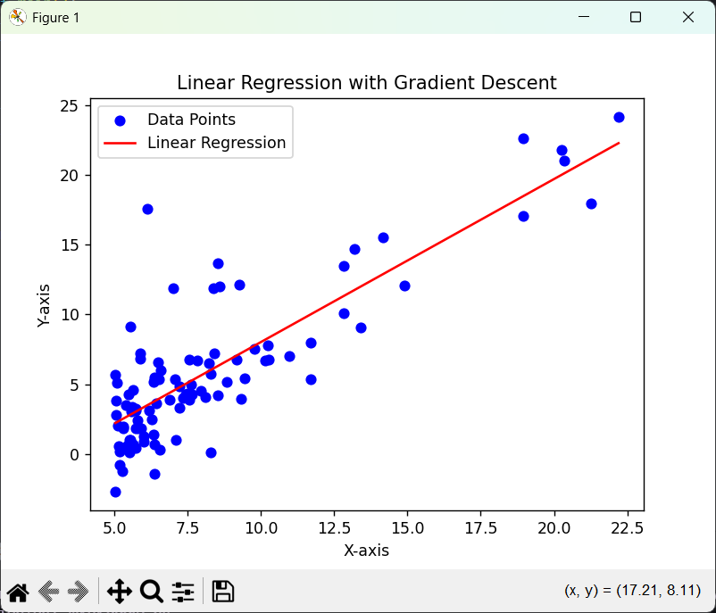
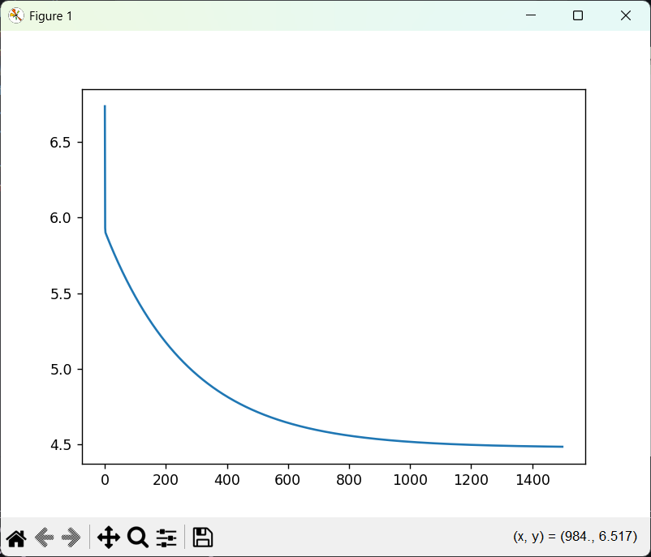

# Manual de Usuario

## Py1_A01028889

### Requisitos

- Archivo `.txt`

  Este archivo debe de contar con los datos en un formato numérico, ya sea flotante o entero. La primera linea se toma como un encabezado. Ejemplo de archivo:

  ```txt
  X Y
  6.1101 17.592
  5.5277 9.1302
  8.5186 13.662
  ...
  ```

  Por defecto el programa buscara el archivo en:

  ```python
    def readDataFile(filePath="Homeworks/MathFundamentals/Py1_SimpleLinearRegression/ex1data1.txt"):
  ```

  Si tu archivo está en la misma carpeta que tu script `.py`, cámbialo a:

  ```python
  def readDataFile(filePath="./ex1data1.txt")
  ```

### Funcionamiento

- Lectura de datos:

  Se cargan nuestros vectores `x` y `y` a partir de nuestra función `readDataFile`

- Definición de valores

  Se define el vector de `theta` en `0's`

  Configuramos los hiperparametros:

  - nuestra tasa de aprendizaje: `alpha = 0.01`
  - número de iteraciones: `iterations = 1500`

- Gradiente descendiente

  Por cada iteración se ajusta el valor de `theta` para minimizar nuestra función de costo.

  Este guarda el historial del costo en un arreglo `J`

- Gráficación

  Una vez teniendo nuestros datos calculados, se gráfica la línea de regresión sobre los datos originales.

### Ejemplo de uso

Archivo txt

```txt
Poblaci�n	Ganacias
6.1101	17.592
5.5277	9.1302
8.5186	13.662
7.0032	11.854
5.8598	6.8233
8.3829	11.886
7.4764	4.3483
8.5781	12
6.4862	6.5987
5.0546	3.8166
5.7107	3.2522
14.164	15.505
5.734	3.1551
8.4084	7.2258
5.6407	0.71618
5.3794	3.5129
6.3654	5.3048
5.1301	0.56077
6.4296	3.6518
7.0708	5.3893
6.1891	3.1386
20.27	21.767
5.4901	4.263
6.3261	5.1875
5.5649	3.0825
18.945	22.638
12.828	13.501
10.957	7.0467
13.176	14.692
22.203	24.147
5.2524	-1.22
6.5894	5.9966
9.2482	12.134
5.8918	1.8495
8.2111	6.5426
7.9334	4.5623
8.0959	4.1164
5.6063	3.3928
12.836	10.117
6.3534	5.4974
5.4069	0.55657
6.8825	3.9115
11.708	5.3854
5.7737	2.4406
7.8247	6.7318
7.0931	1.0463
5.0702	5.1337
5.8014	1.844
11.7	8.0043
5.5416	1.0179
7.5402	6.7504
5.3077	1.8396
7.4239	4.2885
7.6031	4.9981
6.3328	1.4233
6.3589	-1.4211
6.2742	2.4756
5.6397	4.6042
9.3102	3.9624
9.4536	5.4141
8.8254	5.1694
5.1793	-0.74279
21.279	17.929
14.908	12.054
18.959	17.054
7.2182	4.8852
8.2951	5.7442
10.236	7.7754
5.4994	1.0173
20.341	20.992
10.136	6.6799
7.3345	4.0259
6.0062	1.2784
7.2259	3.3411
5.0269	-2.6807
6.5479	0.29678
7.5386	3.8845
5.0365	5.7014
10.274	6.7526
5.1077	2.0576
5.7292	0.47953
5.1884	0.20421
6.3557	0.67861
9.7687	7.5435
6.5159	5.3436
8.5172	4.2415
9.1802	6.7981
6.002	0.92695
5.5204	0.152
5.0594	2.8214
5.7077	1.8451
7.6366	4.2959
5.8707	7.2029
5.3054	1.9869
8.2934	0.14454
13.394	9.0551
5.4369	0.61705
```

Guardado de datos

```bash
x shape:  (97, 2)
x:  [[ 1.      6.1101]
 [ 1.      5.5277]
 [ 1.      8.5186]
 [ 1.      7.0032]
 [ 1.      5.8598]
 [ 1.      8.3829]
 [ 1.      7.4764]
 [ 1.      8.5781]
 [ 1.      6.4862]
 [ 1.      5.0546]
 [ 1.      5.7107]
 [ 1.     14.164 ]
 [ 1.      5.734 ]
 [ 1.      8.4084]
 [ 1.      5.6407]
 [ 1.      5.3794]
 [ 1.      6.3654]
 [ 1.      5.1301]
 [ 1.      6.4296]
 [ 1.      7.0708]
 [ 1.      6.1891]
 [ 1.     20.27  ]
 [ 1.      5.4901]
 [ 1.      6.3261]
 [ 1.      5.5649]
 [ 1.     18.945 ]
 [ 1.     12.828 ]
 [ 1.     10.957 ]
 [ 1.     13.176 ]
 [ 1.     22.203 ]
 [ 1.      5.2524]
 [ 1.      6.5894]
 [ 1.      9.2482]
 [ 1.      5.8918]
 [ 1.      8.2111]
 [ 1.      7.9334]
 [ 1.      8.0959]
 [ 1.      5.6063]
 [ 1.     12.836 ]
 [ 1.      6.3534]
 [ 1.      5.4069]
 [ 1.      6.8825]
 [ 1.     11.708 ]
 [ 1.      5.7737]
 [ 1.      7.8247]
 [ 1.      7.0931]
 [ 1.      5.0702]
 [ 1.      5.8014]
 [ 1.     11.7   ]
 [ 1.      5.5416]
 [ 1.      7.5402]
 [ 1.      5.3077]
 [ 1.      7.4239]
 [ 1.      7.6031]
 [ 1.      6.3328]
 [ 1.      6.3589]
 [ 1.      6.2742]
 [ 1.      5.6397]
 [ 1.      9.3102]
 [ 1.      9.4536]
 [ 1.      8.8254]
 [ 1.      5.1793]
 [ 1.     21.279 ]
 [ 1.     14.908 ]
 [ 1.     18.959 ]
 [ 1.      7.2182]
 [ 1.      8.2951]
 [ 1.     10.236 ]
 [ 1.      5.4994]
 [ 1.     20.341 ]
 [ 1.     10.136 ]
 [ 1.      7.3345]
 [ 1.      6.0062]
 [ 1.      7.2259]
 [ 1.      5.0269]
 [ 1.      6.5479]
 [ 1.      7.5386]
 [ 1.      5.0365]
 [ 1.     10.274 ]
 [ 1.      5.1077]
 [ 1.      5.7292]
 [ 1.      5.1884]
 [ 1.      6.3557]
 [ 1.      9.7687]
 [ 1.      6.5159]
 [ 1.      8.5172]
 [ 1.      9.1802]
 [ 1.      6.002 ]
 [ 1.      5.5204]
 [ 1.      5.0594]
 [ 1.      5.7077]
 [ 1.      7.6366]
 [ 1.      5.8707]
 [ 1.      5.3054]
 [ 1.      8.2934]
 [ 1.     13.394 ]
 [ 1.      5.4369]]

y shape:  (97,1)
y:  [17.592    9.1302  13.662   11.854    6.8233  11.886    4.3483  12.
  6.5987   3.8166   3.2522  15.505    3.1551   7.2258   0.71618  3.5129
  5.3048   0.56077  3.6518   5.3893   3.1386  21.767    4.263    5.1875
  3.0825  22.638   13.501    7.0467  14.692   24.147   -1.22     5.9966
 12.134    1.8495   6.5426   4.5623   4.1164   3.3928  10.117    5.4974
  0.55657  3.9115   5.3854   2.4406   6.7318   1.0463   5.1337   1.844
  8.0043   1.0179   6.7504   1.8396   4.2885   4.9981   1.4233  -1.4211
  2.4756   4.6042   3.9624   5.4141   5.1694  -0.74279 17.929   12.054
 17.054    4.8852   5.7442   7.7754   1.0173  20.992    6.6799   4.0259
  1.2784   3.3411  -2.6807   0.29678  3.8845   5.7014   6.7526   2.0576
  0.47953  0.20421  0.67861  7.5435   5.3436   4.2415   6.7981   0.92695
  0.152    2.8214   1.8451   4.2959   7.2029   1.9869   0.14454  9.0551
  0.61705
```

Inizializar variables

```py
# Initialize theta as a vector of zeros
theta = np.zeros(2)
# Set the learning rate and number of iterations
alpha = 0.01
# Set the number of iterations
iterations = 1500
```

Usar gradiente decendente

```py
theta, J =  gradienteDescendente(x, y, theta, alpha, iterations)
```

Esto nos devuelve el valor final de nuestra `theta` y podemos ver nuestro último valor de nuestro costo

```bash
Final theta:  [-3.63029144  1.16636235]
Final cost J:  4.483388256587726
```

Gràfica de dispersión



Grafica del Error


