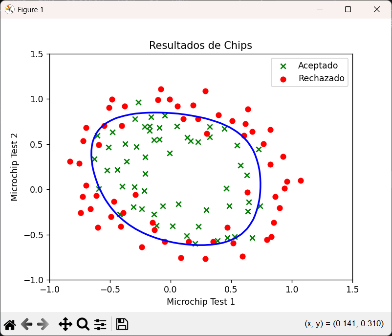
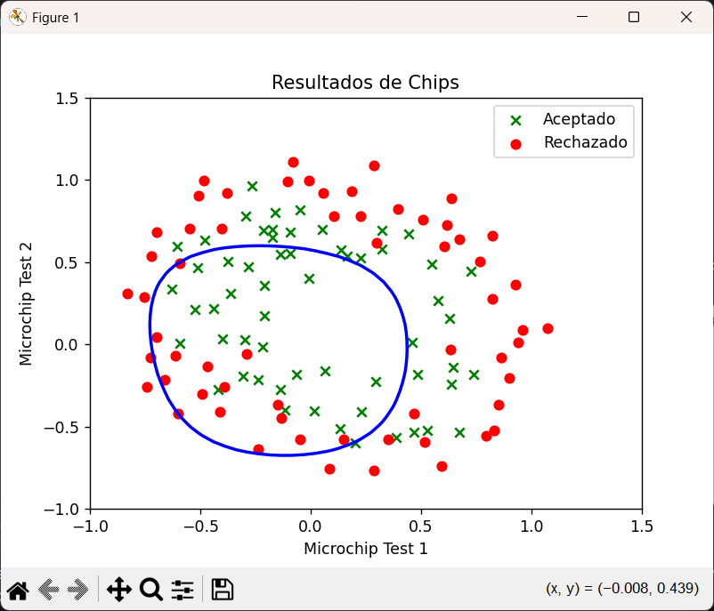

# Manual de Usuario

## Py2_A01028889

### Requisitos

- Archivo `.txt`

  Este archivo debe de contar con los datos en un formato numérico, ya sea flotante o entero. La primera linea se toma como un encabezado. Ejemplo de archivo:

  ```txt
  x1         x2       Y
  0.051267,  0.69956, 1
  -0.092742, 0.68494, 1
  -0.21371,  0.69225, 1
  -0.375,    0.50219, 1
  ...
  ```

  Por defecto el programa buscara el archivo en:

  ```python
    def readDataFile(filePath="Homeworks/MathFundamentals/Py2_SimpleLinearRegression/ex2data2.txt"):
  ```

  Si tu archivo está en la misma carpeta que tu script `.py`, cámbialo a:

  ```python
  def readDataFile(filePath="./ex2data2.txt")
  ```

### Funcionamiento

- Lectura de datos:

  Se cargan nuestros vectores `x` y `y` a partir de nuestra función `readDataFile`

  Aumentamos nuestros datos de `x` para que sea de un polinomio de grado 6

- Definición de valores

  Se define el vector de `theta` en `0's` en base a las dimensiones de nuestro vector `x` ya aumentado

  Configuramos los hiperparametros:

  - nuestra tasa de aprendizaje: `alpha = 0.01`
  - número de iteraciones: `iterations = 15000`
  - valor de lambda: `lambda = 1`

- Calculo de costo

  con nuestra función `funcionCostoReg`

- Gráficación

  Una vez teniendo nuestros datos calculados.

### Ejemplo de uso

Inizializar variables

```py
# lambda value
lmbda = 1
# Set the number of iterations
iterations = 15000
# Initialize theta as a vector of zeros
theta = np.zeros((X_mapped.shape[1]))
```

Usar gradiente decendente

```py
J, gradient  = funcionCostoReg(theta, X_mapped, y, lmbda)
```

### Segundo ejemplo para evaluar la presición 83.050847%

```py
  theta = aprende(theta, X_mapped, y, iterations)
  p = predice(theta, X_mapped)

  acc = 0
  for prediction, y_real in zip(p, y):
  if prediction == y_real:
  acc = acc + 1

  acc = (acc /len(y)) \* 100

  print(f"{acc:.6f}%")
```

### Probar la variación de las lambdas

Poner los valores de lambda que se quieran probar en la siguiente lista

```py
  lmbda_tests = [1, 0, 100]
```

Estos valores se van a iterar en nuestro for cambiando el valor de nuestra lambda en nuestro ejercicio, mostrandonos como esto afecta la presición resultante.

```py
for l in lmbda_tests:
      theta = aprende(theta, X_mapped, y, iterations, l)
      p = predice(theta, X_mapped)

      acc = 0
      for prediction, y_real in zip(p, y):
        if prediction == y_real:
            acc = acc + 1

      acc = (acc /len(y)) * 100

      print(f"{acc:.6f}%")

```

### Resultado de ejemplos

**Gráfico cuando lambda = 1**



**Gráfico cuando lambda = 100**


