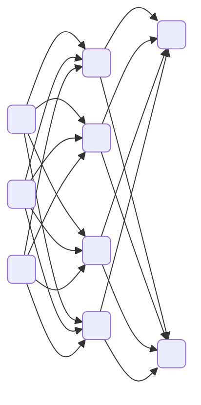

# TC3006C

## Advance Artificial Intelligence for Data Science I

Aug 2025

> [!WARNING]
> This is a warning message.

Phase 1: Neural Network

```mermaid
graph LR
a( )-->e( );
a( )-->f( );
a( )-->g( );
a( )-->h( );

b( )-->e( );
b( )-->f( );
b( )-->g( );
b( )-->h( );

c( )-->e( );
c( )-->f( );
c( )-->g( );
c( )-->h( );

e( )-->i( );
e( )-->j( );


f( )-->i( );
f( )-->j( );


g( )-->i( );
g( )-->j( );


h( )-->i( );
h( )-->j( );


```
